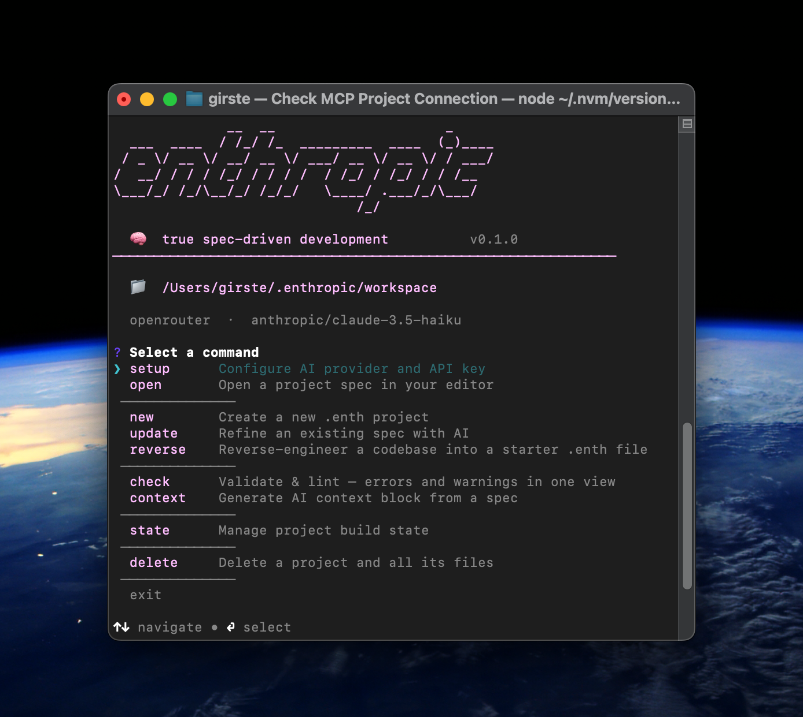
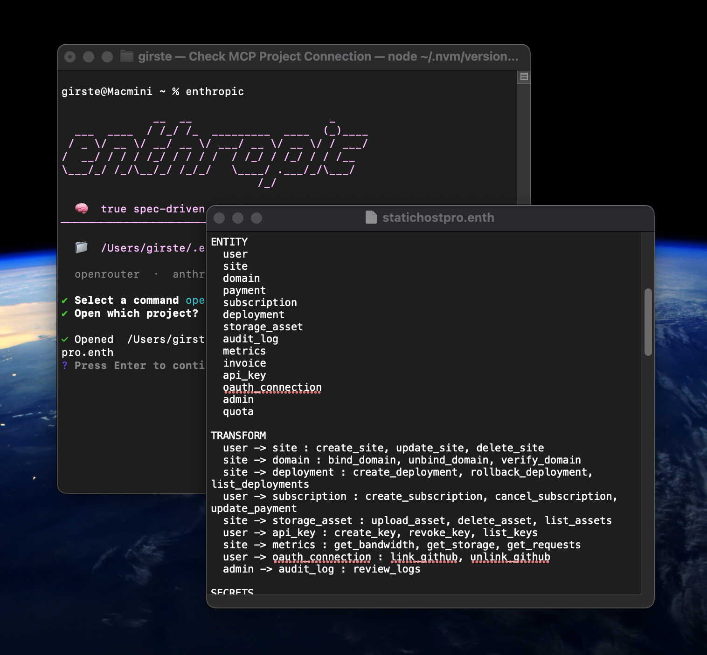

[](https://www.npmjs.com/package/enthropic)
[](https://github.com/enthropic-spec/enthropic-tools/actions/workflows/ci.yml)
[](https://github.com/enthropic-spec/enthropic-tools/actions/workflows/lint.yml)
[](https://github.com/enthropic-spec/enthropic-tools/actions/workflows/codeql.yml)
[](https://github.com/enthropic-spec/enthropic-tools/actions/workflows/security-scan.yml)
[](https://securityscorecards.dev/viewer/?uri=github.com/Enthropic-spec/enthropic-tools)
[](https://slsa.dev)

CLI companion for the [Enthropic](https://github.com/enthropic-spec/enthropic) spec format.

---

**Enthropic** is a format for machine-readable project specifications.

A `.enth` file is the architectural contract of your project — expressive enough for a developer to read at a glance, unambiguous enough for any AI to act on without guesswork.

```
VERSION 1

PROJECT "my-api"
  LANG    python
  STACK   fastapi, postgresql, redis
  ARCH    layered

ENTITY user, session, order

LAYERS
  API
    CALLS SERVICE
  SERVICE
    CALLS STORAGE
  STORAGE

CONTRACTS
  user.password NEVER plaintext
  admin.*       REQUIRES verified-auth

SECRETS
  DATABASE_URL
  JWT_SECRET
```

The `enthropic` CLI validates your spec, tracks build progress, and produces the context block you give to any AI assistant. Unlike a pile of `.md` files, a `.enth` is structured, machine-readable, and produces the same architectural result across every session, every model, every team member.

## Install

```bash
npm install -g enthropic
```

Requires Node.js 20+. No telemetry.

<!-- screenshots -->



## Usage

```
enthropic            # interactive menu
enthropic setup      # one-time: configure AI provider + API key
enthropic new        # create a new .enth project (guided)
enthropic check      # validate + lint — errors and warnings in one view
enthropic context    # spec + state → AI context block (opens in editor)
enthropic state      # manage build progress
```

## Commands

```bash
enthropic setup                          # configure provider, API key, model

enthropic new                            # guided project creation
enthropic build      [file]              # AI conversation to design the spec
enthropic update     [file]              # refine existing spec with AI
enthropic reverse    [dir]               # (beta) reverse-engineer a codebase into a starter spec
enthropic open                           # open a project in $EDITOR

enthropic check      [file]              # errors + warnings grouped by severity
enthropic context    [file]              # spec + state → AI context block

enthropic state      show    [file]
enthropic state      set <entity> <status> [file]

enthropic delete                         # delete a project
```

`[file]` defaults to the `.enth` file in `~/.enthropic/workspace/<project>/`.

## Generated files

`enthropic check` on a valid spec creates two files:

**`state_[name].enth`** — build progress, updated as you work.

```
STATE myapp

  ENTITY
    user              PENDING
    session           PENDING
    order             PENDING

  LAYERS
    API               PENDING
    SERVICE           PENDING
    STORAGE           PENDING
```

`SECRETS` declared in the spec are requirements — they tell the AI what env vars the project needs. Managing their values is outside the tool's scope.

## Roadmap

#### v0.1.0 ✅  Parser, validator, check, context, new, build, update, reverse, state, setup, open/delete, SLSA Level 3.
#### v0.2.0 ✅  `npm install -g enthropic`, automated release pipeline, npm provenance.

#### v0.3.0 — Expressiveness  
`DECISIONS` block — architectural choices with rationale. Richer `CONTRACTS` operators — cardinality, pre/post conditions.

#### v0.4.0 — Standard  
Public spec registry + GitHub Action for `enthropic check` in CI. One `.enth` per archetype, contribution guidelines.

#### v0.5.0 — Security  
Stack-aware security patterns injected automatically in `context`. No new syntax — invisible, not optional.

## Spec

The `.enth` format is defined in [enthropic/SPEC.md](https://github.com/Enthropic-spec/enthropic/blob/main/SPEC.md).

---

[](LICENSE)
[](https://nodejs.org)
[](https://www.npmjs.com/package/enthropic)

